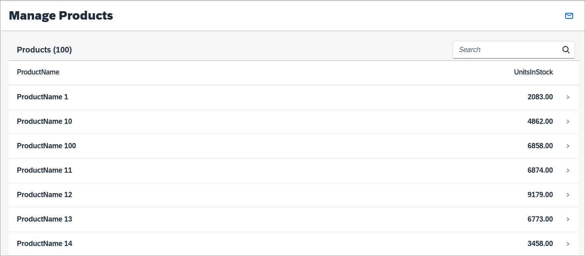
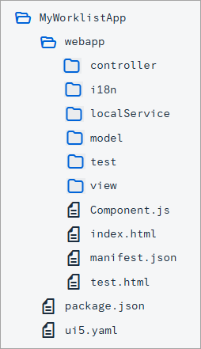

<!-- loiofc2c35880ccf4282a6baf8ab861bc10e -->

# Step 1: Creating the Initial App

In this step, we set up the initial app.

***

<a name="loiofc2c35880ccf4282a6baf8ab861bc10e__section_ed2_4dd_lbb"/>

## Preview

  
  
**The worklist app**

***

<a name="loiofc2c35880ccf4282a6baf8ab861bc10e__section_cnf_d4b_l4b"/>

## Setup

1.  To set up your project for this tutorial, download the files at [Worklist App - Step 1](https://ui5.sap.com/#/entity/sap.m.tutorial.worklist/sample/sap.m.tutorial.worklist.01).

2.  Extract the downloaded `.zip` file at the desired location on your local machine.
3.  Open a shell in the extracted folder and execute `npm install`.
4.  Execute `npm start` to start the web server and to open a new browser window hosting `test/mockServer.html`.

> ### Note:  
> The texts in the `i18n.properties` file are automatically generated based on the template Customizing \(OData entity set, entities, properties, and texts\). The result can be incorrect texts like "Enter an <Products\> name or a part of it." You should therefore revise the generated texts in the `i18n.properties` file.

***

<a name="loiofc2c35880ccf4282a6baf8ab861bc10e__section_iyw_fnp_l4b"/>

## Structure

With the downloaded code from the Demo Kit, you have an initial app structure with the following content inside the `webapp` folder:

  
  
**Folder structure of the initial project**

-   **Home Page** \(`webapp/view/Worklist.view.xml` file\)

    The home page of the app shows a table of products including the corresponding number of units in the stock. The title of the table shows how many items are available. A search field in the header toolbar of the table allows you to search for a product by name. Pressing a table row navigates the user to a new page that shows the details of the pressed product.

-   **Data**

    You can run the app with the real service or with the mock server serving mock data. In the `webapp/localService/mockserver.js` file, the mock server is configured. Using the mock server in this tutorial allows us to easily run the code even without network connection and without the need of having a remote server for our application data. To run the app with the mock server and its corresponding mock data the `/webapp/test/mockServer.html` file has to be called in the browser.

    The `webapp/localService/metadata.xml` file is used by the mock server to describe our OData service. In this step, the mock server will generate mock data based on this file. In a subsequent step the mock server will use our own custom mock data.

-   **Configuration of the App**

    In the `webapp/manifest.json` descriptor file, we configure our app. The descriptor file contains the following relevant sections:

    -   `sap.app`

        In this section we reference an `i18n.properties` file and use a special syntax to bind the texts for the title and description properties. In the `dataSources` section, we tell our app where to find our `mainService` OData service. As you might guess, the URI correlates to the `rootUri` of our mock server instance, which can be found in `webapp/localService/mockserver.js`. It is important that these two paths match to allow our mock server to provide the test data we defined above.

    -   `sap.ui5`

        In the `sap.ui5` section, we declare with the `rootView` parameter that our `mycompany.myapp.MyWorklistApp.view.App` view shall be loaded and used as the `rootView` for our app.

        Furthermore, we define two models to be automatically instantiated and bound to the component: an `i18n` model and a default model `""`. The latter references our `mainService` `dataSource`, which is declared in our `sap.app` section as an OData 2.0 data source. The `i18n` file can be found at `webapp/i18n/i18n.properties`. The `mainService` data source will be mocked by our mock server.

    > ### Note:  
    > There is a `test.html` file in the `webapp` folder. This file serves as an easy entry point for developers to run and test the app in various ways during development. It contains links to the relevant files inside the `test` folder, which you can use to run with the Mock Server or to run unit tests and OPA tests.

**Parent topic:**[Worklist App Tutorial](worklist-app-tutorial-6a6a621.md "In this tutorial we will build an app using OpenUI5 that, for example, a shop owner can use to manage his product stock levels.")

**Previous:**[Step 2: Custom Mock Data](step-2-custom-mock-data-3118903.md "In this step, we want to change the mock data of the initial app.")

**Related Information**  

[Folder Structure: Where to Put Your Files](../05_Developing_Apps/folder-structure-where-to-put-your-files-003f755.md "The details described here represent a best practice for structuring an application that features one component, one OData service and less than 20 views. If you're building an app that has more components, OData services and views, you may have to introduce more folder levels than described here.")

