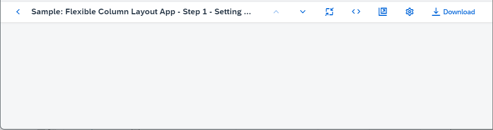
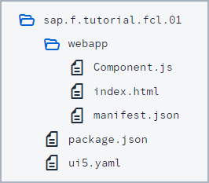

<!-- loio59b772bfac5241b89c16b12395c1116c -->

# Step 1: Setting Up the Initial App

We start by setting up a basic OpenUI5 app for this tutorial.

The structure in this step will be used throughout the rest of this tutorial. The basic OpenUI5 app created in this step will be extended in the subsequent steps to illustrate the main `FlexibleColumnLayout` features.

***

<a name="loio59b772bfac5241b89c16b12395c1116c__section_ed2_4dd_lbb"/>

## Preview

  
  
**The basic OpenUI5 app**

***

<a name="loio59b772bfac5241b89c16b12395c1116c__section_cnf_d4b_l4b"/>

## Setup

1.  To set up your project for this tutorial, download the files at [Flexible Column Layout App - Step 1](https://ui5.sap.com/#/entity/sap.f.tutorial.fcl/sample/sap.f.tutorial.fcl.01).

2.  Extract the downloaded `.zip` file at the desired location on your local machine.
3.  Open a shell in the extracted folder and execute `npm install`.
4.  Execute `npm start` to start the web server and to open a new browser window hosting `index.html`.

You should have the same files as displayed in the following figure:

  
  
**Folder structure with downloaded files**

**Parent topic:**[Flexible Column Layout App Tutorial](flexible-column-layout-app-tutorial-c4de2df.md "In this tutorial, we showcase how to structure your OpenUI5 app using the layout patterns that comply with the SAP Fiori design guidelines.")

**Previous:**[Step 2: Creating an Empty Flexible Column Layout](step-2-creating-an-empty-flexible-column-layout-bf38e4d.md "In this step, we add an instance of the sap.f.FlexibleColumnLayout control in the main view of the app.")

