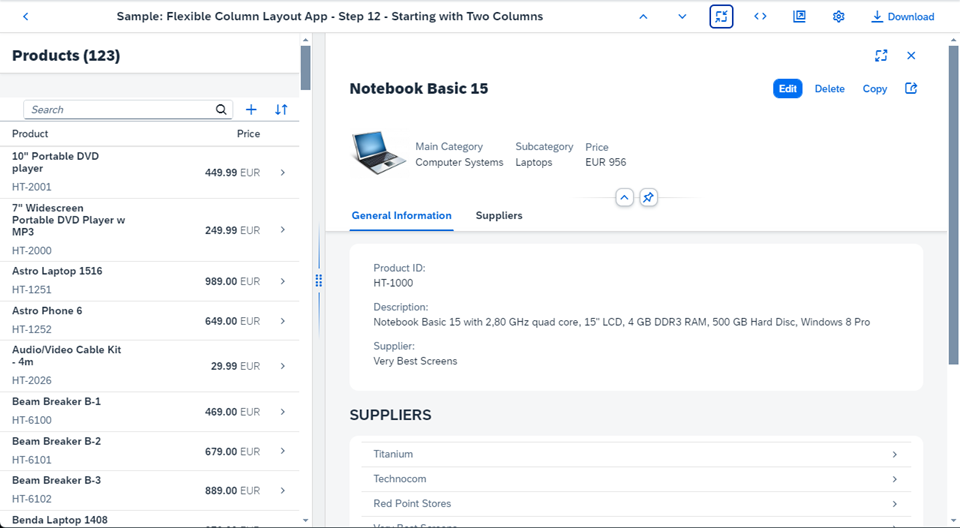

<!-- loioa96fbe44ae6544589a096041f99d38c2 -->

# Step 12: Starting with Two Columns

In this step, we set up the app to start with an initial layout of two columns.

By default, the `FlexibleColumnLayout` starts off with one column. If your use case requires it, you can set the initial layout to start with two columns. The user can still navigate to a single-column layout by closing the detail page from the navigation actions or a three-column layout by selecting an item from the detail page.

***

<a name="loioa96fbe44ae6544589a096041f99d38c2__section_yfh_d31_12b"/>

## Preview

  
  
**Initial layout with two columns**



***

<a name="loioa96fbe44ae6544589a096041f99d38c2__section_fd2_4dd_lbb"/>

## Coding

You can view and download all files at [Flexible Column Layout App - Step 12](https://ui5.sap.com/#/sample/sap.f.tutorial.fcl.12/preview).

***

<a name="loioa96fbe44ae6544589a096041f99d38c2__section_wlp_xpj_l4b"/>

## webapp/Component.js \[MODIFY\]

```js
		...
		getHelper: function () {
			return this._getFcl().then(function(oFCL) {
				var oSettings = {
					defaultTwoColumnLayoutType: fioriLibrary.LayoutType.TwoColumnsMidExpanded,
					defaultThreeColumnLayoutType: fioriLibrary.LayoutType.ThreeColumnsMidExpanded,
					initialColumnsCount: 2
				};
				return (FlexibleColumnLayoutSemanticHelper.getInstanceFor(oFCL, oSettings));
			 });
		},
		...
```

We set the `initialColumnsCount` parameter of the `getHelper` method to `2`.

**Parent topic:**[Flexible Column Layout App Tutorial](flexible-column-layout-app-tutorial-c4de2df.md "In this tutorial, we showcase how to structure your OpenUI5 app using the layout patterns that comply with the SAP Fiori design guidelines.")

**Next:**[Step 11: Using the Flexible Column Layout Semantic Helper](step-11-using-the-flexible-column-layout-semantic-helper-276f001.md "In this step, we use the sap.f.FlexibleColumnLayoutSemanticHelper class to implement the recommended UX patterns for layout changes in the app.")

**Previous:**[Step 13: Setting the List-Detail Pattern](step-13-setting-the-list-detail-pattern-cb38637.md "In this step, we set up the app to follow the list-detail pattern.")

