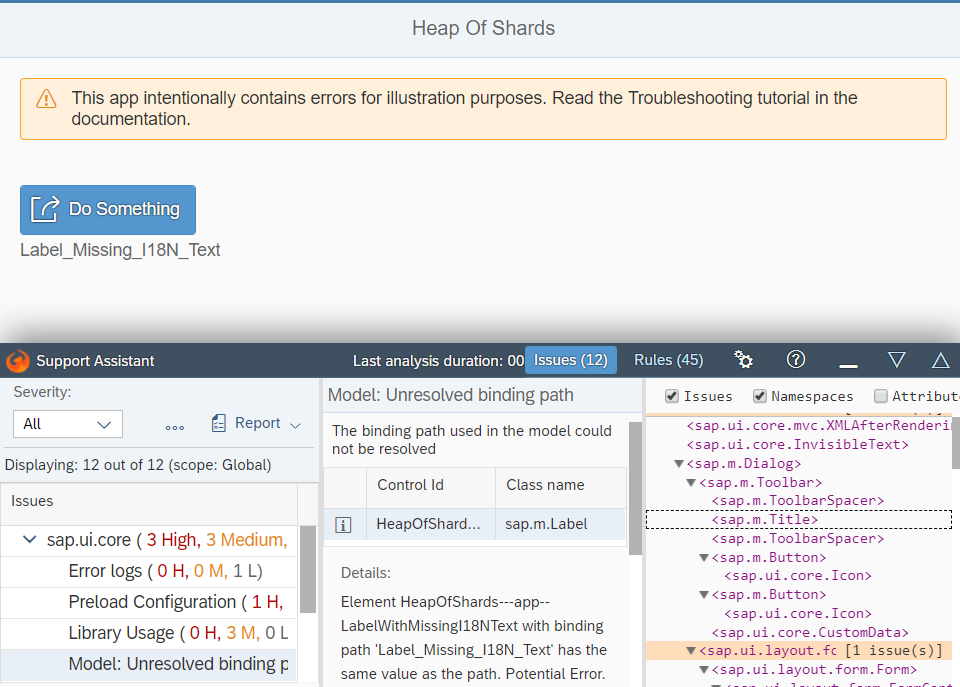

<!-- loio35f08e10a5d74e058ce9929244d935f0 -->

# Step 3: Support Assistant

In this tutorial step, we will have a closer look at Support Assistant. You can use this tool to check whether your app is built according to the best practices with predefined rules.

***

<a name="loio35f08e10a5d74e058ce9929244d935f0__section_u2k_c1d_5z"/>

## Preview



***

<a name="loio35f08e10a5d74e058ce9929244d935f0__section_hkm_s4f_vz"/>

## Opening the Example App and Support Assistant

1.  Download the example app with errors from the Demo Kitat [Troubleshooting](https://ui5.sap.com/#/entity/sap.ui.core.tutorial.troubleshooting/sample/sap.ui.core.tutorial.troubleshooting.01) and run the app.

2.  Activate the Support Assistant using one of the following options:

    -   Open the *Technical Information Dialog* by pressing [Ctrl\] + [Shift\] + [Alt\] + [P\]  and choose *Activate Support Assistant*.

    -   Use the URL parameter: `sap-ui-support=true`.


    The Support Assistant toolbar opens in the footer of the app.


***

<a name="loio35f08e10a5d74e058ce9929244d935f0__section_b2v_bzk_zz"/>

## Analyzing and Fixing Issues

1.  In the *Support Assistant* toolbar, choose *Rules*.

2.  In the *Available Rules* tab, select all rules, and choose *Analyze*.

    You now see a list of issues.

3.  Select *Model: Unresolved binding path* in the list of issues. In the issue details, you see the following message: *Element HeapOfShards---app--LabelWithMissingI18NText with binding path 'Label\_Missing\_I18N\_Text' has the same value as the path. Potential Error.*

4.  Open the `i18n.properties` file in your development environment and add the missing text.

    ```
    […]
    item1Text=Item 1
    item2Text=Item 2
    selectEventMessage=Event "{0}" fired.
    Label_Missing_I18N_Text=Label Text
    
    ```

    For more information, see [Walkthrough Step 8: Translatable Texts](step-8-translatable-texts-df86bfb.md)

5.  Restart the app and start the analysis again. This issue should now be gone. We have intentionally hidden some more errors in the code - check and see if you can find and correct them.


**Parent topic:**[Troubleshooting Tutorial](troubleshooting-tutorial-5661952.md "In this tutorial, we will show you some tools that will help you if you run into problems with your OpenUI5 app.")

**Next:**[Step 2: Technical Information Dialog](step-2-technical-information-dialog-63c97ef.md "In this tutorial step, we will have a closer look at the &quot;Technical Information Dialog&quot;. This tool comes in handy whenever you want to know the technical details of the running application, and also has some other useful features.")

**Previous:**[Step 4: Diagnostics Window](step-4-diagnostics-window-04b75ea.md "In this tutorial step, we have a closer look at the Diagnostics window. It offers a wealth of information including comprehensive technical information, a control tree, and debugging features.")

**Related Information**  


[Support Assistant](../04_Essentials/support-assistant-57ccd7d.md "The Support Assistant enables developers to check whether their apps are built according to the OpenUI5 best practices and guidelines.")

